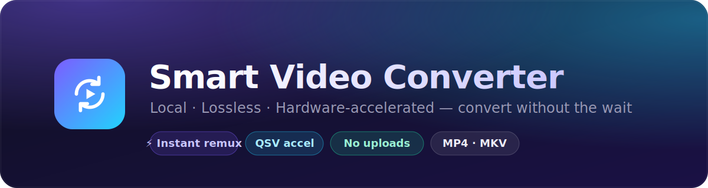
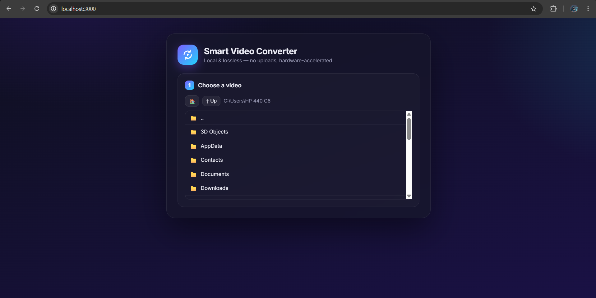
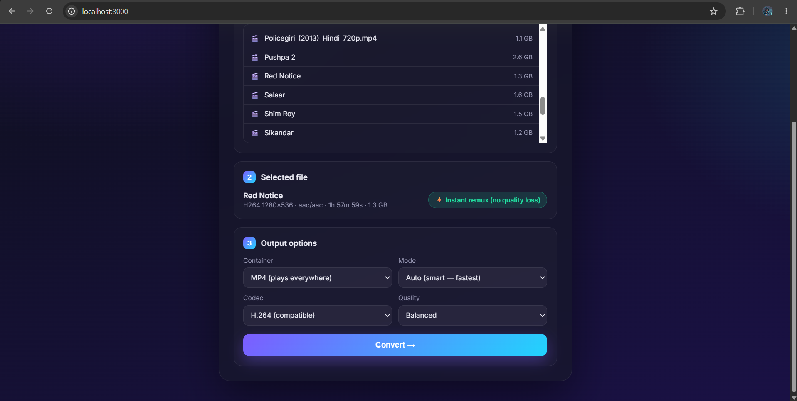
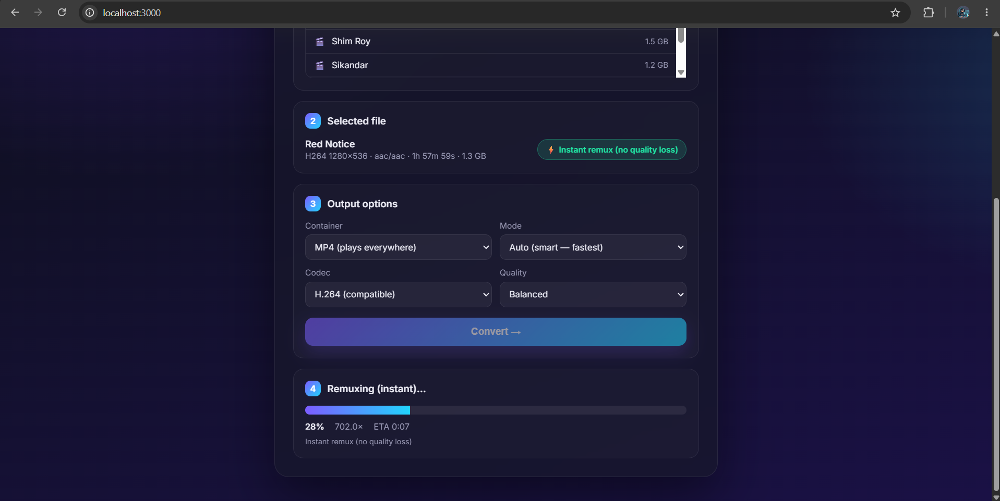
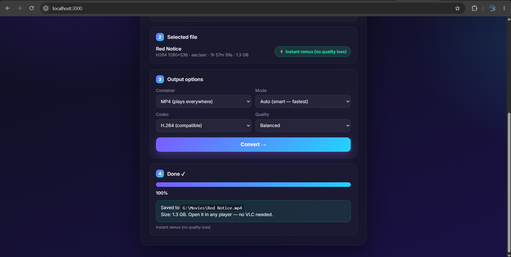

<div align="center">



<br/>

**Convert any video to a universally-playable MP4 — locally, losslessly, and _fast_.**
No uploads. No quality loss. Hardware-accelerated.

<br/>

[](https://nodejs.org)
[](https://python.org)
[-007808?logo=ffmpeg&logoColor=white)](https://ffmpeg.org)
[](LICENSE)


<br/>

[Features](#-features) · [Why it's fast](#-why-its-fast) · [Requirements](#-requirements) · [Installation](#%EF%B8%8F-installation) · [Usage](#%EF%B8%8F-usage) · [How it works](#-how-it-works) · [FAQ](#-faq)

</div>

---

## 📖 Overview

Ever downloaded a movie that **only opens in VLC** and won't play on your phone, TV, or the
normal player on your computer? 😩 Annoying, right?

**Smart Video Converter** fixes that in a couple of clicks. You pick the video, press one
button, and you get a clean **`.mp4`** that plays **everywhere** — usually in just a few seconds,
with **no loss in quality**.

Here's the trick that makes it so fast: most of the time the video inside the file is already
fine — only its "wrapper" is wrong. So instead of slowly re-recording the whole movie, the app
just **puts it in the right wrapper** — think of it like moving a DVD into a new case rather than
re-burning the disc. Same movie, brand-new box, done in seconds. (And when a video *does* need
real conversion, it quietly uses your computer's graphics chip to speed things up.)

> ⚡ A full **2.5-hour, 1.4 GB movie** converted **in about 21 seconds** on an ordinary laptop.

No technical setup, no uploading huge files to the internet — everything happens **right on your
own computer**.

---

## 📸 See it in action

Four steps, start to finish — no manual, no guesswork:

<div align="center">

<table>
<tr>
<td width="50%" valign="top">

<br/><b>1 — Pick your video</b><br/>
<sub>Browse to any movie already on your computer.</sub>
</td>
<td width="50%" valign="top">

<br/><b>2 — One click to convert</b><br/>
<sub>It instantly shows the fastest option — just press <b>Convert</b>.</sub>
</td>
</tr>
<tr>
<td width="50%" valign="top">

<br/><b>3 — Watch it fly</b><br/>
<sub>Live progress — often <b>hundreds of times</b> faster than real-time.</sub>
</td>
<td width="50%" valign="top">

<br/><b>4 — Done — plays anywhere</b><br/>
<sub>Saved next to the original, ready for any phone, TV, or player.</sub>
</td>
</tr>
</table>

</div>

---

## ✨ Features

Everything you need, nothing you don't:

- 🎯 **Smart engine** — automatically picks the cheapest correct operation: instant remux,
  copy-video + re-encode-audio, or a full transcode.
- ⚡ **Instant remux** — already-compatible files (e.g. H.264 + AAC in an MKV) are rewritten
  with `-c copy`: **lossless and near-instant**, regardless of length.
- 🚀 **Hardware acceleration** — Intel **Quick Sync** (`h264_qsv` / `hevc_qsv`) when re-encoding,
  with an automatic **software fallback** (`libx264` / `libx265`) if QSV is unavailable.
- 📁 **No uploads** — runs on your machine and reads files **directly from disk by path**, so a
  multi-GB file starts converting instantly instead of being uploaded.
- 📊 **Live progress** — real-time progress bar with **speed (e.g. `38×`)** and **ETA**,
  streamed over a WebSocket. The UI never freezes.
- 📦 **MP4 & MKV** output, H.264 / H.265 codecs, and High / Balanced / Small quality presets.
- 🎨 **Clean, modern UI** — gradient/glass design, built-in file browser, no build step.
- 🔒 **Non-destructive** — your original file is never modified; output is written alongside it.

---

## 🚀 Why it's fast

In plain terms: it skips the slow work whenever it possibly can. For the curious, here's how —

| Technique | What it does | Impact |
|---|---|---|
| **No upload** | Reads the file straight from disk by path | A 1.4 GB file starts **instantly** — no upload wait |
| **Smart remux** (`-c copy`) | Rewrites only the container when codecs already fit | **Seconds for any length**, zero quality loss |
| **QSV hardware encode** | Offloads encoding to the iGPU when re-encoding is required | The weak CPU is no longer the bottleneck |
| **Software fallback** | Retries with `libx264`/`libx265` if QSV init fails | Conversion always completes |
| **Streamed progress** | FFmpeg `-progress` parsed and pushed over WebSocket | Live %, speed & ETA; responsive UI |

---

## 📋 Requirements

| Tool | Minimum | Recommended | Notes |
|---|---|---|---|
| **Node.js** | `18.x` | `20 LTS` or `22.x` | Uses ES modules, `node:` core APIs, and the `ws` package. |
| **Python** | `3.8` | `3.10+` | Standard library only — **no `pip install` needed**. Launched as `python` (Windows) / `python3` (macOS/Linux). |
| **FFmpeg** | `5.0` | `6.0+` **full build** | Must include `ffmpeg` **and** `ffprobe` on your `PATH`. For QSV acceleration, use a **full build** (the gyan.dev "full" build on Windows, or distro `ffmpeg`). |

> ✅ Verified locally on **Node v24.14**, **Python 3.13**, **FFmpeg 8.0 full build**
> (Intel UHD 620 / Quick Sync).

---

## ⚙️ Installation

### 1. Install FFmpeg (with `ffprobe`)

<details open>
<summary><b>Windows</b></summary>

```powershell
winget install Gyan.FFmpeg.Full
```
…or download the **"full"** build from <https://www.gyan.dev/ffmpeg/builds/> and add its
`bin` folder to your `PATH`.
</details>

<details>
<summary><b>macOS</b></summary>

```bash
brew install ffmpeg
```
</details>

<details>
<summary><b>Linux (Debian/Ubuntu)</b></summary>

```bash
sudo apt update && sudo apt install -y ffmpeg
```
</details>

Verify:

```bash
ffmpeg -version
ffprobe -version
```

### 2. Install Node.js and Python

- **Node.js 18+** → <https://nodejs.org> · check with `node -v`
- **Python 3.8+** → <https://python.org> · check with `python --version` (or `python3 --version`)

### 3. Clone and run

```bash
git clone https://github.com/<your-username>/video-converter.git
cd video-converter
npm install
npm start
```

Then open **<http://localhost:3000>** in your browser. That's it — there's no Python package to
install (the engine uses the standard library only).

---

## ▶️ Usage

1. **Browse** to your video using the built-in file browser. Use **🏠** for drives/home and
   **↑ Up** to go one folder up.
2. **Select** a file. The app analyzes it and shows a badge:
   - **⚡ Instant remux (no quality loss)** — it'll just change the container.
   - **Re-encode video (hardware QSV)** — a transcode is needed.
3. **Choose options** (Container `MP4`/`MKV`, Codec `H.264`/`H.265`, Quality). Codec & quality
   only apply when re-encoding.
4. Click **Convert →** and watch the live progress, speed and ETA.
5. The output is saved **next to the original** (e.g. `Movie.mp4`). Your original is untouched.

---

## 🧠 How it works

```
┌──────────────┐   REST (browse / analyze)   ┌──────────────┐   spawn    ┌──────────────────┐
│   Browser    │ ──────────────────────────► │   Node.js    │ ─────────► │  Python engine   │
│  public/*    │                             │  server.js   │            │  engine/engine.py│
│  (UI)        │ ◄───────── WebSocket ─────── │ (orchestrate)│ ◄───────── │   (JSON lines)   │
└──────────────┘     live progress / done     └──────────────┘  progress  └────────┬─────────┘
                                                                                    │ spawn
                                                                              ┌─────▼─────┐
                                                                              │  FFmpeg   │
                                                                              └───────────┘
```

- **Node (`server.js`)** serves the UI, provides a server-side file browser, and runs each job
  by spawning the Python engine, relaying its progress to the browser over a WebSocket.
- **Python (`engine/engine.py`)** is the brain:
  - `--analyze <file>` → runs `ffprobe`, classifies streams, and recommends a plan
    (remux / fast / transcode).
  - `--convert <file> --format mp4 --codec h264 --quality balanced --mode auto` → builds the
    right FFmpeg command, runs it with `-progress pipe:1`, and emits JSON-line events:
    `{"type":"progress",...}` → `{"type":"done",...}` / `{"type":"error",...}`.

---

## 🛠️ Configuration

| Variable | Default | Description |
|---|---|---|
| `PORT` | `3000` | Port the web server listens on. |

```bash
# example
PORT=8080 npm start
```

---

## ❓ FAQ

<details>
<summary><b>I converted a Hindi-dubbed movie and it became English. Why?</b></summary>

Your Hindi audio **isn't gone** — the file simply had **multiple audio tracks** (e.g. English +
Hindi), and the converter keeps **all** of them. Players default to the **first/default** track,
which is often English. Open the output in **VLC → Audio → Audio Track → Hindi** to switch.
*(A built-in audio-track / default-language selector is on the roadmap.)*
</details>

<details>
<summary><b>Where is the converted file saved?</b></summary>

Right **next to the original**, with the new extension (e.g. `Movie.mkv` → `Movie.mp4`). If a
file with that name already exists, ` (converted)` is appended. The original is never modified.
</details>

<details>
<summary><b>Is the conversion lossless?</b></summary>

When the badge says **⚡ Instant remux**, yes — it's a pure container rewrite (`-c copy`), so
the video is bit-for-bit identical. Re-encodes (QSV/software) are high-quality but not lossless.
</details>

<details>
<summary><b>My subtitles disappeared in the MP4.</b></summary>

MP4 can't hold many subtitle formats (e.g. `ass`, PGS), so they're dropped for MP4 output.
Choose **MKV** as the container to keep subtitle/extra tracks.
</details>

<details>
<summary><b>Do I need an NVIDIA GPU?</b></summary>

No. Acceleration uses **Intel Quick Sync (QSV)**. If QSV isn't available, it automatically falls
back to a software encoder, so it works everywhere FFmpeg does.
</details>

---

## 🗺️ Roadmap

- [ ] Audio-track / default-language selector (pick which dub to keep or default)
- [ ] Drag-and-drop file selection
- [ ] Batch / queue multiple conversions
- [ ] More targets (WebM/VP9, audio-only extract)
- [ ] Per-job subtitle handling (burn-in / keep / convert to `mov_text`)

---

## 🤝 Contributing

Contributions are welcome! Open an issue to discuss a change, or send a PR. Please keep the
**no-disturbance** spirit: the engine and UI are intentionally small and dependency-light.

---

## 📄 License

Released under the **MIT License** — see [LICENSE](LICENSE).

<div align="center">

<sub>Built with ⚡ Node.js · 🐍 Python · 🎬 FFmpeg</sub>

</div>
